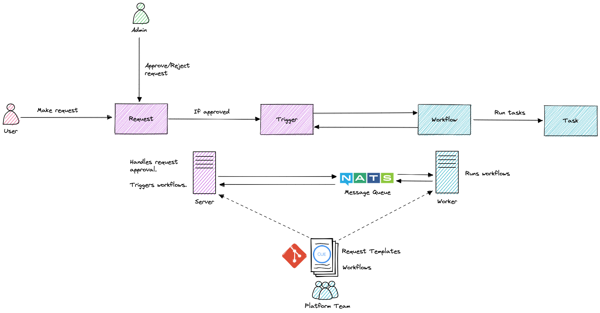

# Coastline

> The self-service portal to automate the mundane

[](https://goreportcard.com/report/github.com/verifa/coastline)
[](https://opensource.org/licenses/Apache-2.0)

## What is Coastline?

Coastline is a web service that enables users to make Requests for predefined Request Templates, that trigger workflows to automate mundane tasks (like giving users access, creating new resources, etc.).

### How it works?



The Platform Team defines Request Templates and associated Workflows using CUE, and Coastline provides a web portal for users to login and make Requests (based on the Request Templates).

There is an approval process for Requests, and once approved, the server triggers a workflow.

### Who is it for?

Coastline is aimed at Platform Teams who maintain infrastructure and tooling for software teams, to provide a self-service portal for automating mundane tasks.

### Goal

The goal of Coastline is to automate simple tasks to provide better developer experience and allow platform teams to focus on things that matter.

### Example request

Below is a simple example request and workflow for requesting Cat Facts from: <https://catfact.ninja/>

```cue
package basic

import (
 "encoding/json"
 
 "github.com/verifa/coastline/tasks/http"
)

// CatFact defines a Request Template for users to make requests for,
// and providing an optional maxLength for the cat fact they wish for
#CatFact: {
 kind: "CatFact"
 service: {
  selector: {
   matchLabels: {
    tool: "catfact"
   }
  }
 }
 spec: {
  // Max length of cat fact
  maxLength: int | *100
 }
}

// Define a workflow for the CatFact request which calls the Cat Fact
// REST API to retrieve a random cat fact within the maxLength given
workflow: CatFact: {
 input: #CatFact

 step: api: http.Get & {
  url: "https://catfact.ninja/fact"
  request: {
   params: {
    max_length: "\(input.spec.maxLength)"
   }
  }
 }

 output: {
  fact: json.Unmarshal(step.api.response.body).fact
 }
}

```

## Terminology

**Request Template** - A request template is written in CUE and defines the specification (i.e. inputs/parameters) for a Request which users can make

**Request** - A request is made by users according to a specific Request Template

**Trigger** - A trigger is automatically created when a Request is approved

**Workflow** - A workflow is written in CUE and defines what should happen when a trigger for a Request is made

**Task** - Workflows execute tasks that actually do something (like making HTTP requests)

## License

This code is released under the [Apache-2.0 License](./LICENSE).
